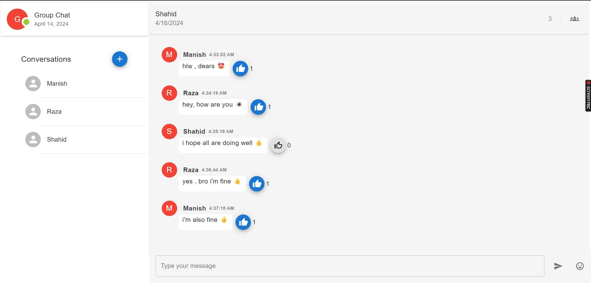
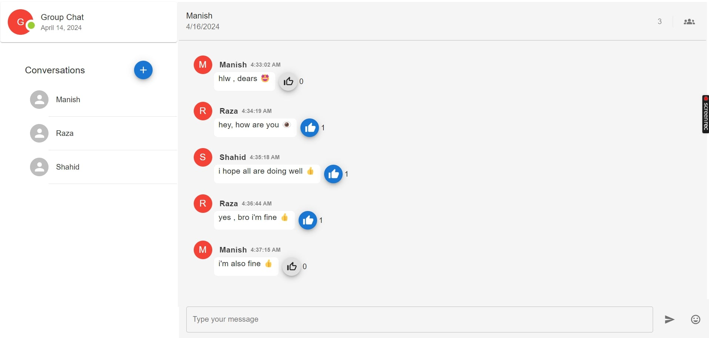
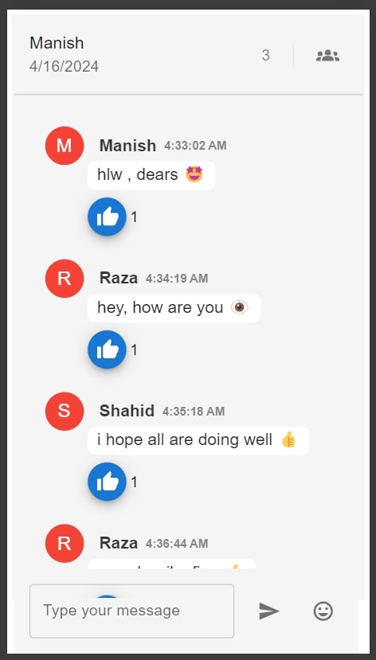

## Live Link:
Hosted Link: https://shahid-chat.onrender.com
## Run Locally

### Note

Clone a project

```bash
  git clone 786Shaahid/chatapp
```

Go to the project directory

```bash
  cd chatapp
```

Install dependencies for backend

```bash
  npm install
```

Install dependencies for backend

```bash
  cd frontend && npm install
```

Start the local server from root directory

```bash
  npm run backend
```

Start the frontend from root directory

```bash
  npm run frontend
```
## Screenshots:
#Desktop


 #  Mobile 


