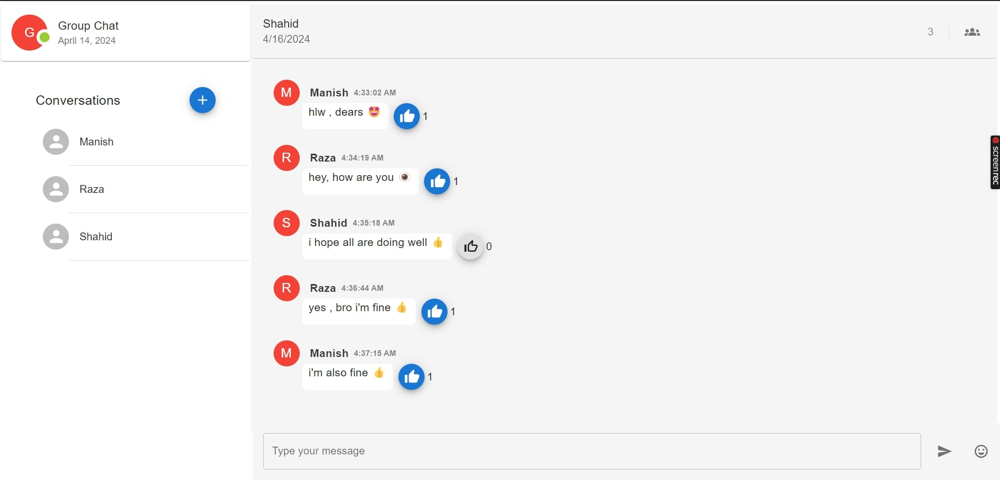
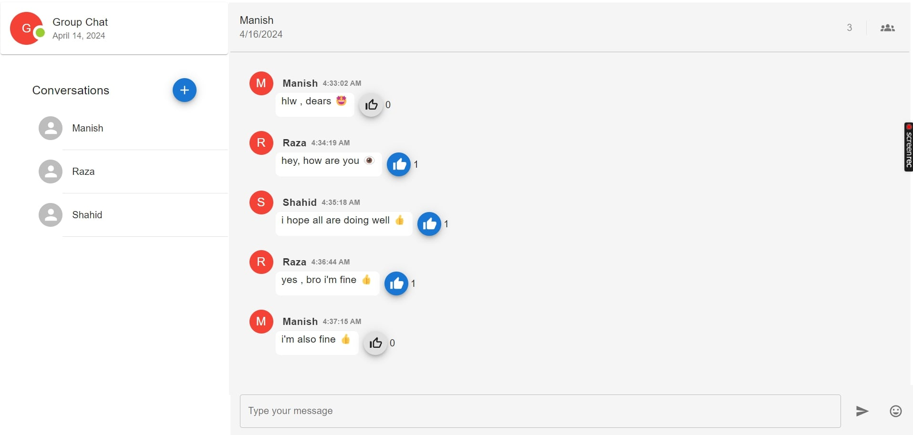

# Group Chat

### Description
Our group chat app, powered by React, Material-UI, Socket.IO, Express , and Node.js, offers real-time messaging, group conversations. With a responsive design and seamless integration of modern technologies,  visually appealing, and interactive platform for dynamic communication and collaboration.

## API Reference

#### URL = 

## Environment Variables

To run this project locally, you will need to add the following environment variables to your .env file created in root directory of your project

PORT

#### Note: Also, you will need to update proxy in package.json by localhost:${port_number}

## Screenshots

###  On Destop 

### On Destop

### On Mobile screen

